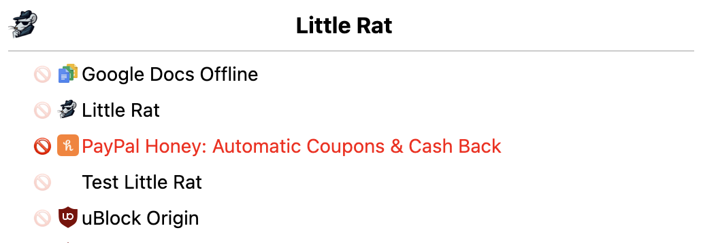
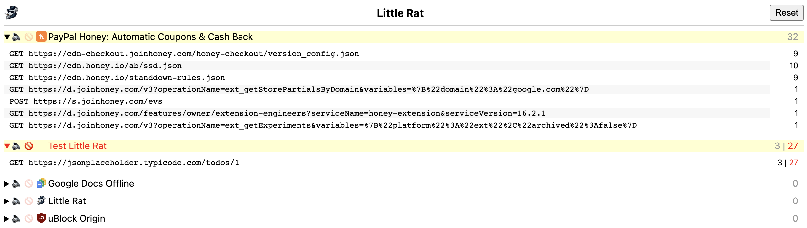

#   little-rat
Small chrome extension to monitor (and optionally block) other extensions' network calls

### Chrome Web Store (Lite version)
The published extension lacks the ability to track the number of requests and notify you, but you can still use it for blocking requests. The reason is that the extension uses the `declarativeNetRequest.onRuleMatchedDebug` API which is not available for publishing in the Chrome Web Store.
Get it [here](https://chrome.google.com/webstore/detail/little-rat/oiopkpalpilladnibecobcecijffaflf)

### Manual Installation (Full Version)
- Download the [ZIP](https://github.com/dnakov/little-rat/archive/refs/heads/main.zip) of this repo.
- Unzip
- Go to chromium/chrome *Extensions*.
- Click to check *Developer mode*.
- Click *Load unpacked extension...*.
- In the file selector dialog:
    - Select the directory `little-rat-main` which was created above.
    - Click *Open*.
### Screenshots  
  

### Author
https://twitter.com/dnak0v
